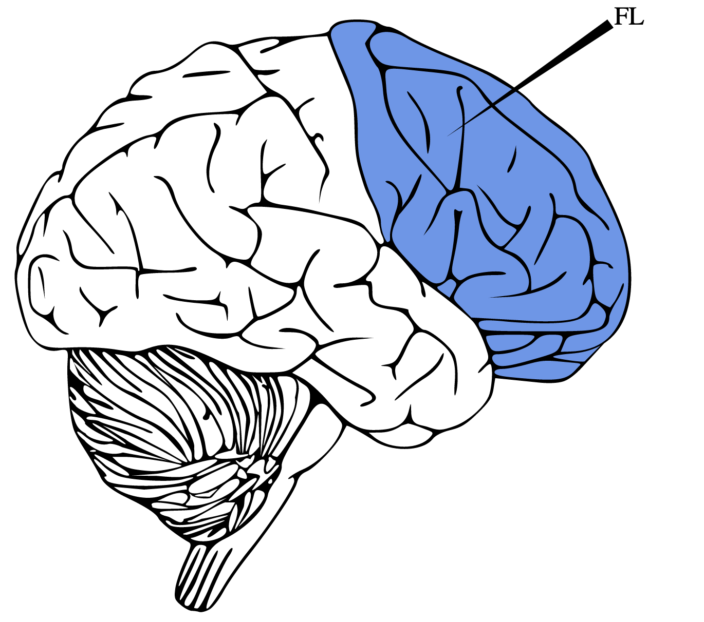
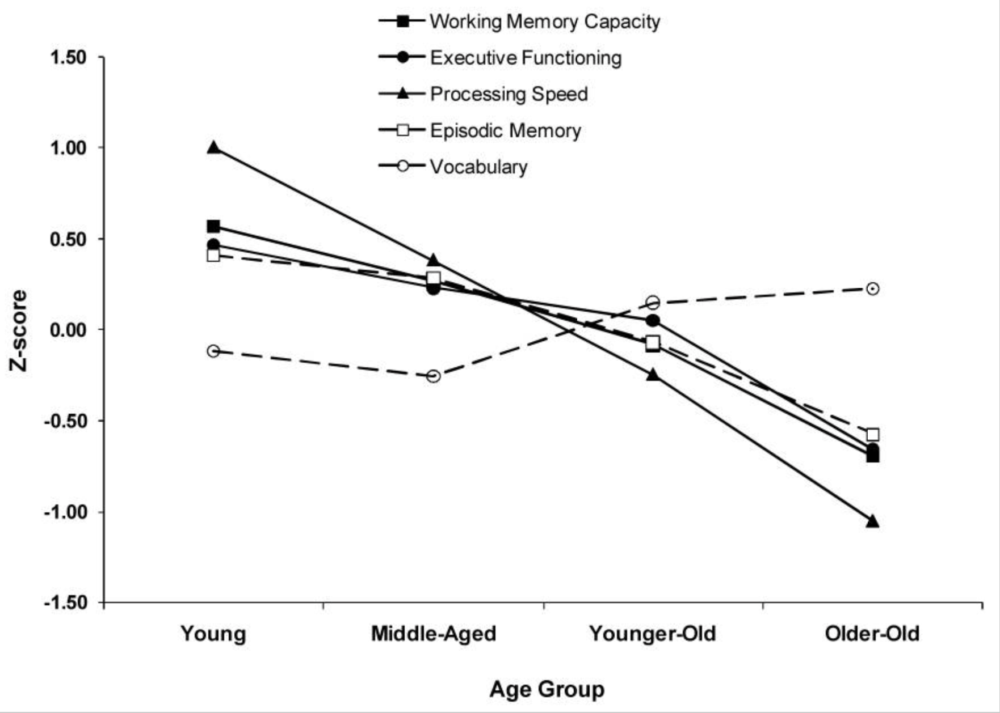
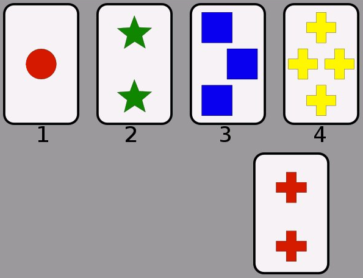
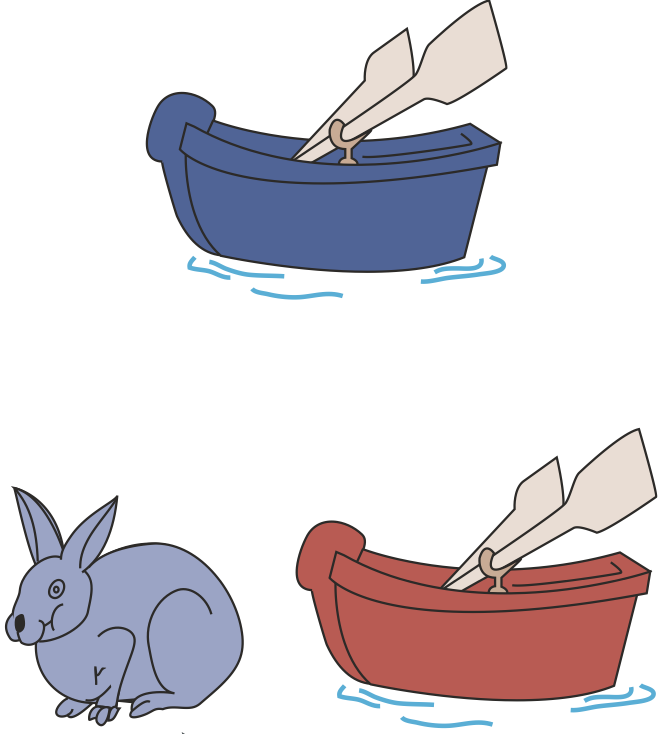

class:  center, middle
```{r setup, include=FALSE}
options(htmltools.dir.version = FALSE)
library(xaringanExtra)
xaringanExtra::use_tile_view()
xaringanExtra::use_tachyons()
xaringanExtra::use_panelset()
xaringanExtra::use_editable()
```


## Cognitive tasks and reaction times

</br>

# Cognition and cognitive tasks


</br>
</br>


.large[Alessandro Tomassini | Education Tripos Part 1B | 03 March 2021]


---
# Cognition
* Cognition is also referred as cognitive control or executive function

* It refers to cognitive processes associated with the control of thought and action


.pull-left[ .center[**Executive functions**]

   .ba.bw1.br3.shadow-0.ph3.mt0[
Selective **attention** (e.g. filtering out distractors)
   
**working memory**
   
**Cognitive flexibility** (e.g. task switching)
   
**Inhibitory control** (e.g. overcoming prepotent responses)

**Fluid intelligence** (e.g. reasoning and problem-solving)
   
   ]
     ]


.pull-right[

</br>

.center[]
]

---
# Cognition

.center[**Executive functions gradually develop and change across the lifespan**]

</br>

.center[]

*<font size = "3">  "McCabe et al (2010) "The Relationship Between Working Memory Capacity and Executive Functioning: Evidence for a Common Executive Attention Construct", Neuropsychologia </font>*


---
## Cognitive tests for children: .red[Stanford–Binet Intelligence Scales]

.pull-left[

</br>

* Individually administered test

* Originally developed to diagnose intellectual deficiencies in young children
* Consists of both verbal and nonverbal subtests

* Latest versions more engaging: wider range in the age of the test takers

* Currently used to assess intellectual capabilities of people ranging from young children all the way to young adults

* Current uses include clinical, educational and career assessments

]
.pull-right[ .center[**Executive functions**]

   .ba.bw1.br3.shadow-0.ph3.mt0[
.red[**Selective attention**]
   
.red[**working memory**]
   
.gray[**Cognitive flexibility** ]
   
.gray[**Inhibitory control** ]

.red[**Fluid intelligence** ]
   
   ]
   
.center[**Non-Executive functions**]

   .ba.bw1.br3.shadow-0.ph3.mt0[
.red[**Visuo-spatial processing**]
   
.red[**Knowledge**]
]
]


---
## Cognitive tests for children: .red[Wisconsin Card Sorting Test]
.pull-left[
**Task:** A number of cards are showed. The task is to match the card. The matching rules change and are not revealed but the participant is told whether the match is right or wrong (e.g. they have to infer the rule and respond to rule-switching).


</br>

</br>

* Originally developed to diagnose frontal lobe dysfunctions

* Can be administered to children as young as 5 years

* Relies on functions such as attention, working memory and visual processing although they cannot be assessed by the test (other tests needed)

* Particinats can learn strategies in the long run

]
.pull-right[ 
.center[]

.center[**Executive functions**]

   .ba.bw1.br3.shadow-0.ph3.mt0[
.gray[**Selective attention**]
   
.gray[**working memory**]
   
.red[**Cognitive flexibility**]
   
.red[**Inhibitory control** ]

.red[**Fluid intelligence** (e.g. reasoning and problem-solving)]
   
   ]
   
]


---
## Cognitive tests for children: .red[Dimensional Change Card Sort]
.pull-left[
**Task:** Participants sort bivalent cards (e.g., blue boat) one way (e.g., by color) and then are instructed to switch and sort the same cards a new way (e.g., by shape). Exercising flexibility of this kind is particularly difficult for children. Three- and four-year-olds typically perseverate by repeatedly sorting by old rules after being instructed to switch and sort by new rules.


</br>

* Originally developed to asses executive functioning early in development (3-7yo)

* Performance is impaired in attention-deficit/hyperactivity disorder (ADHD) and autism

* Very tolerable: simple and short (duration = 5 minutes)

* It may include also reaction times.

]
.pull-right[ 
.center[]

.center[**Executive functions**]

   .ba.bw1.br3.shadow-0.ph3.mt0[
.gray[**Selective attention**]
   
.gray[**working memory**]
   
.red[**Cognitive flexibility**]
   
.red[**Inhibitory control** ]

.red[**Fluid intelligence** (e.g. reasoning and problem-solving)]
   
   ]
   
]

---

class:  center, middle

# End of part 1

---
