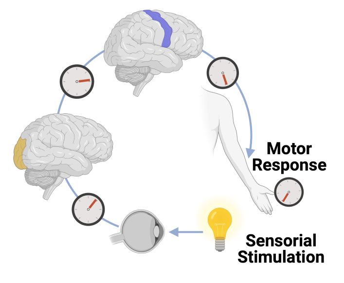
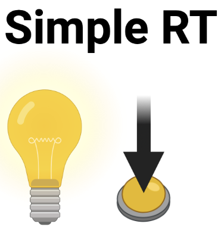
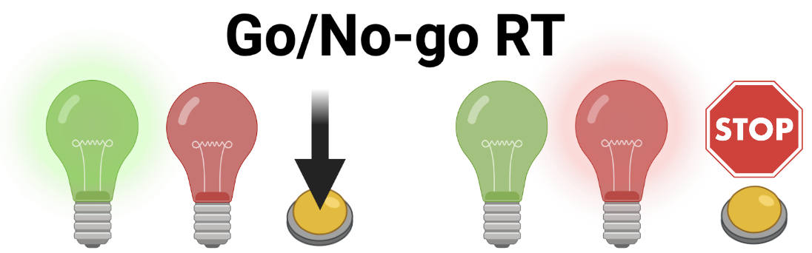
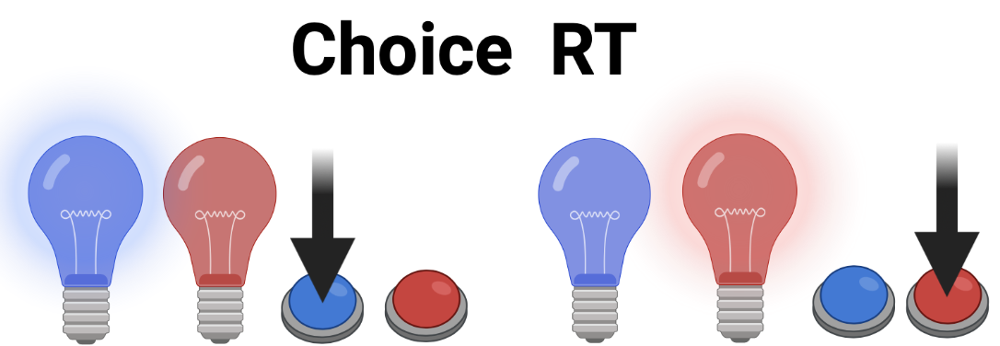
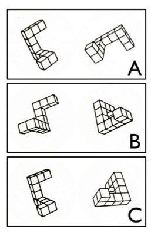
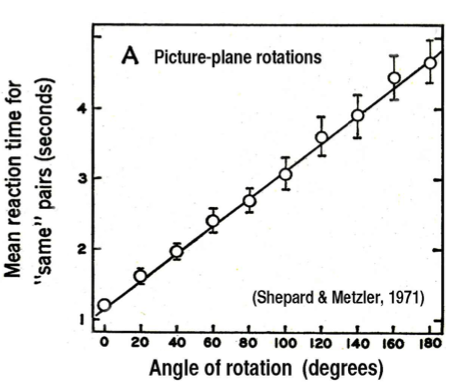
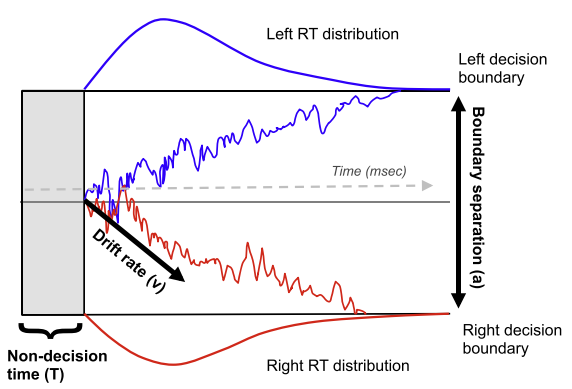
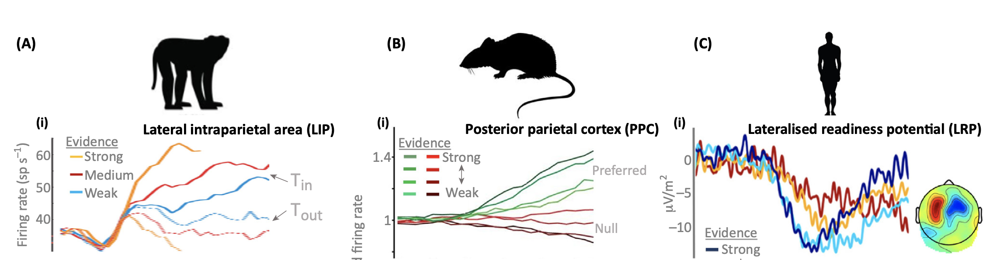

class:  center, middle
```{r setup, include=FALSE}
options(htmltools.dir.version = FALSE)
library(xaringanExtra)
xaringanExtra::use_tile_view()
xaringanExtra::use_tachyons()
xaringanExtra::use_panelset()
xaringanExtra::use_editable()
```


## Cognitive tasks and reaction times

</br>

# Reaction Times


</br>
</br>


.large[Alessandro Tomassini | Education Tripos Part 1B | 03 March 2021]


---
# Reaction times
**Mental chronometry**: the study of **reaction times** in  visuo-motor tasks to infer content, duration and temporal sequencing of mental operations.


.pull-left[ 
</br>
</br>

* Objective behavioural method (cfr subjective reports)

* Reflects (i.e. is a **correlate** of) cognitive processes linking perception to motor responses

* Reaction times systematically vary with task manipulations (e.g. difficulty)

* Thus, inferences can be made about the nature of the processes affected by experimental manipulations.

     ]


.pull-right[


.center[]
]

---
# Subtraction method
Franciscus Donders (1818-1889) proposed a *subtraction method* to time the different mental processes underlying different tasks
.pull-left[
</br>

* **Simple Reaction Times**: Time to perceive a stimulus and initiate a motor response

</br>

* **Go/No-Go Reaction Times**: Time to perceive a stimulus, .red[**discriminate between colours**] and initiate a motor response.

</br>

* **Choice Reaction Times**: Time to perceive a stimulus, discriminate between colours, .red[**choose appropriate motor action**] and initiate a motor response.

 
]

.pull-right[
.center[]

.center[]

.center[]
]


---
# Subtraction method

.pull-left[

</br>
 .ba.bw1.br3.shadow-0.ph3.mt0[
* **Go/No-Go RT - Simple RT**: Time required to .red[**discriminate between colours**]

</br>


* **Choice RT- Go/No-Go RT**: Time required to .red[**choose the appropriate motor action**]
]

</br>

** Caveat **: Subtraction method based on the **strong** assumption that insertion of an additional processing stage does not affect the operation of the other stages (*Pure insertion*, Sternberg, 1969)

]
.pull-right[
.center[]

.center[]

.center[]
]


---
# A paradigmatic example
**Shepard & Metzler (1971)** investigated how mental images are transformed (e.g. rotated) by showing pairs of identical or mirror-reversed shapes in different orientations.
.pull-left[
**Task:** Decide whether pairs were identical or different
.center[]


]
.pull-right[ 
**Results:** Linear relationship between angular disparity of stimuli and RT.

**Interpretation:** Subjects mentallly rotate one representation to check if it matches the other

.center[]
]


---
## .red[**Drift-diffusion model**] of  Reaction Times
The drift diffusion model (Ratcliff, 1978) is the dominant mathematical framework to explain RT and accuracy in RT tasks.

It allows to decompose behaviour into meaningful latent cognitive variables (e.g perceptual, motor, decision)

.pull-left[
**Main idea:** Evidence for a choice (e.g. what button to press) accumulates over time until a decision boundary is reached and a response is made.

**Parameters:**

* **Decision boundary**:  .red[**caution in responding**] (high boundaries- longer response time, higher accuracy)

* **Drift-rate**: .red[**certainty about stimulation**] e.g. visibility of the stimulus (high drift-rate- shorter response time)

* **Non-decision time**: time required for.red[**perceptual encoding and motor processes**] 


]
.pull-right[ 

.center[**Drift-Diffusion Model**]


.center[]


   
]
---
## .red[**Drift-diffusion model**] of  Reaction Times
Importantly the Drift-diffusion model allows to .red[**link reaction times, to cognitive processes and brain activity**] across species


</br>


.center[]

</br>
</br>

.gray[*<font size = "3">  "O'Connell et al (2018) "Bridging neural and computational viewpoints on perceptual decision-making", Trends in Neurosciences </font>*]
---

class:  center, middle

# End of part 2

---
