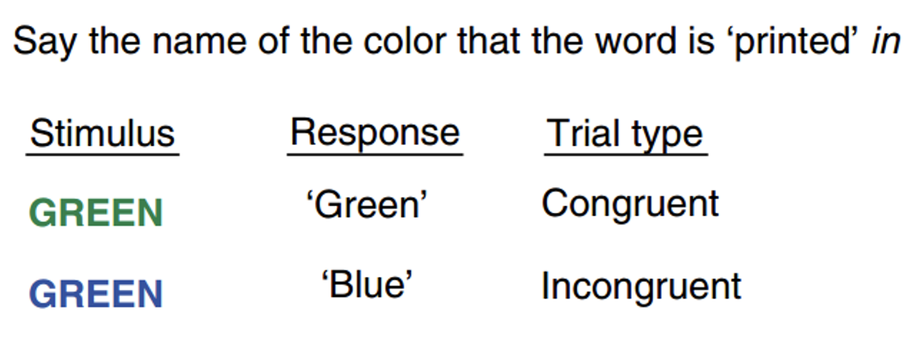
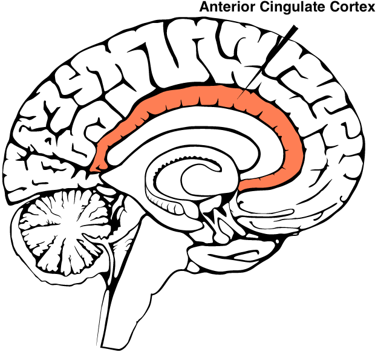
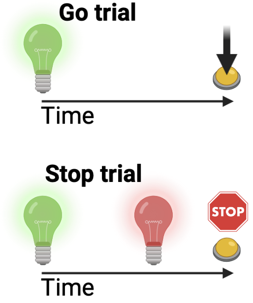
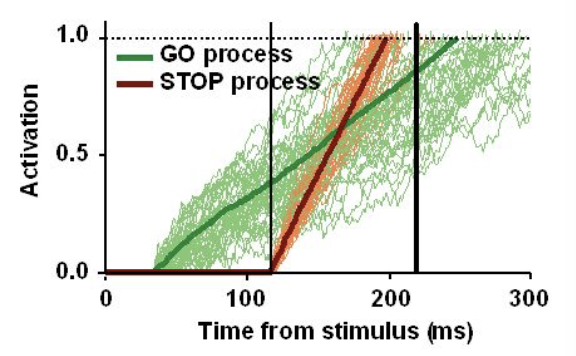

class:  center, middle
```{r setup, include=FALSE}
options(htmltools.dir.version = FALSE)
library(xaringanExtra)
xaringanExtra::use_tile_view()
xaringanExtra::use_tachyons()
xaringanExtra::use_panelset()
xaringanExtra::use_editable()
```


## Cognitive tasks and reaction times

</br>

# Reaction Times & Cognition


</br>
</br>


.large[Alessandro Tomassini | Education Tripos Part 1B | 03 March 2021]


---
# Reaction times are related to cognitive functions

</br>
</br>
* Robust evidence for a clear relationship between RT and cognitive functions 

* The association between RT and cognition is stronger for more complex tasks

* Brain diseases (e.g. Parkinson's, schizophrenia) and developmental disorders (e.g. ADHD, autism) are characterised by altered performance in various RT tasks
</br>
</br>
</br>
</br>

.gray[*<font size = "3">  "Sheppard & Vernnon (2008) "Intelligence and speed of information-processing: A review of 50 years of research", Personality and Individual Differences </font>*]

.gray[*<font size = "3">  "Deary et (2001) "Reaction times and intelligence differences: A population-based cohort study", Intelligence </font>*]

.gray[*<font size = "3">  "Weigard et al., (2019) "Cognitive Modeling Suggests That Attentional Failures Drive Longer Stop-Signal Reaction Time Estimates in Attention Deficit/Hyperactivity Disorder", Clinical Psychological Science </font>*]

---
# The Stroop test

.panelset[
.panel[.panel-name[Stroop effect]
.pull-left[
**Task:** Override the impulse to read a word out loud and instead indicate the color of the word.

** The Stroop Effect** : longer reaction times for color identification in incongruent trials compared to congruent trials.

** Interpretation**: Fast, automatic process of reading the word interferes with the relatively slower, non-automatic, process of identifying the colour of the text (Stroop, 1935).

Stroop task performance explained by changes in drift-rate (Gajewski et al., 2020).

Relies on the anterior cingulate cortex.
]

.pull-right[

.ba.bw1.br3.shadow-0.ph3.mt0[

.center[]


]


.center[]


]

.gray[*<font size = "3">  "Gajewski et al., (2020) "Stroop task performance across the lifespan: High cognitive reserve in older age is associated with enhanced proactive and reactive interference control", Neuroimage </font>*]

]

.panel[.panel-name[Cognitive development]

* RT to Stroop tasks decreases systematically from early childhood through early adulthood:

  - Speed of processing increases with age
  
  - Cognitive control becomes increasingly efficient
  
* Age-related changes associated with developemnet in various domains:
  
  - .red[**Working memory**]
  - .red[**Inhibitory control**], fundamental to regulate behaviour (e.g. overcome the automatic reflex to read the work to report the color of the letters)
  
  
  
  
 .gray[<font size = "3"> 
   </br>
  1. Demetriou, A., Christou, C., Spanoudis, G., & Platsidou, M. (2002). The development of mental processing: Efficiency, working memory, and thinking. Monographs of the Society for Research in Child Development
 </br>
  2. Demetriou, A., Efklides, A., & Platsidou, M. (1993). The architecture and dynamics of developing mind: Experien¬tial structuralism as a frame for unifying cognitive developmental theories. Monographs of the Society for Research in Child Development
 </br> 
  3. Kellogg, Ronald T. (2013). The making of the mind : the neuroscience of human nature. Amherst, New York: Prometheus Books
 </font>   
]
]


]


---
# The Stop-Signal task
.panelset[
.panel[.panel-name[Inhibitory control]
.pull-left[
**Task:** Respond as quickly as possible to a given stimulus (**go trial**). Abort any response when a subsequently presented **stop signal** is presented.

 </br> 
  </br> 

**Interpretation**: A race between a go process, triggered by the go stimulus, and a stop process, triggered by the stop signal. 

When the stop process reaches the boundary before the go process, the response is inhibited (*independent race*).

Relies on cortico-basal-ganglia-thalamocortical circuits

]

.pull-right[


.center[]
.center[]


]


]

.panel[.panel-name[Cognitive development]

* The ability to inhibit a prepotent motor response improves with age during childhood (4-12 years).

* Error monitoring (i.e. slowing down on trial following errors) emerges around 6 years.

* Inhibition measures derived from the task correlate with teachers rating of inattention.

* Poor inhibitory control in adult with ADHD associated with slow 'stop process': selective deficit in inhibition.

* Children with ADHD associated show slow 'stop' and 'go' processes: general deficit in cognitive control.

 
 .gray[<font size = "3"> 
   </br>
  1. Tillman et al., (2008). Motor response inhibition and execution in the stop-signal task: development and relation to ADHD behaviors. Child Neuropsychology. 
  </br>
  2. Dupuis et al., (2019). Response Time Adjustment in the Stop Signal Task: Development in Children and Adolescents. Child Development.
 </br>
  3. Verbruggen & Logan (2008). Response inhibition in the stop-signal paradigm. Trends Cognitive Sciences

 </font>   
]
]


]


---

class:  center, middle

You can explore, in your own time, a number of examples of classic experiments available online:

.centre[http://www.psytoolkit.org]

# Thank you for your attention.

---
